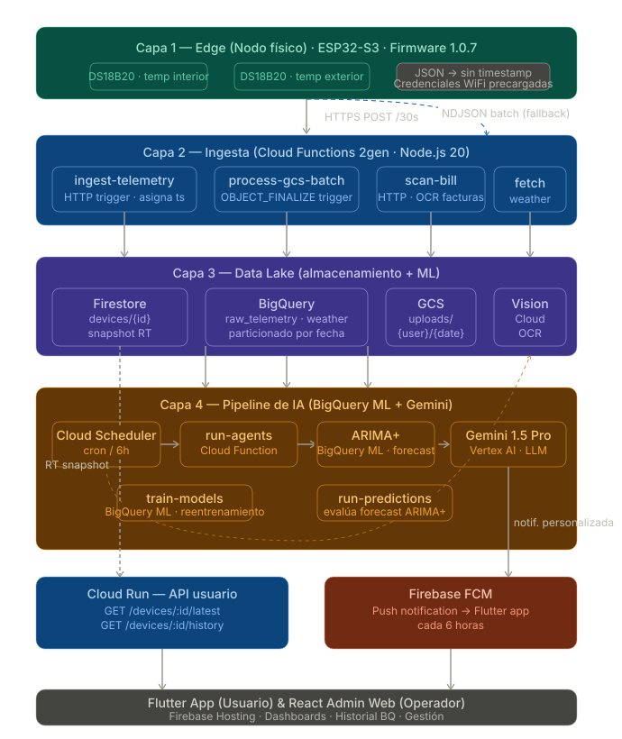
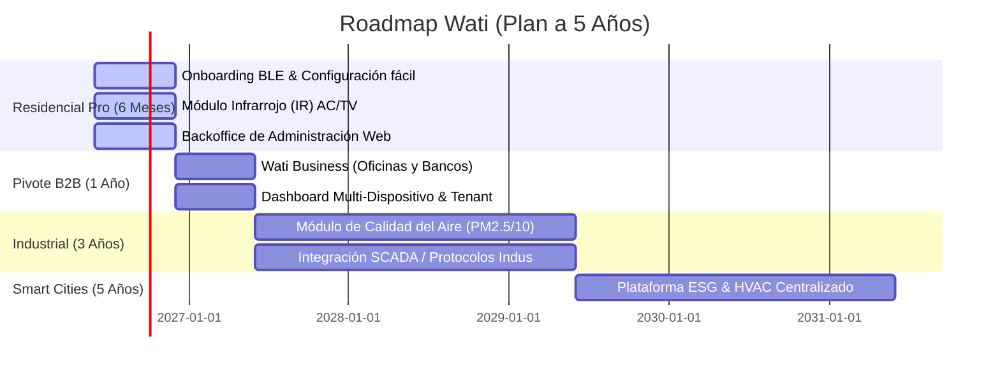

# ⚡ Wati

### Sistema Inteligente de Optimización del Consumo Eléctrico Residencial

> **Hackathon Build With AI 2026** · Categoría: **ENERGÍA** · Santa Cruz de la Sierra, Bolivia

[](https://buildwithai.bo)
[](#)
[](#)
[](#)

---

## ✅ Requisitos del Repositorio

- Todos los integrantes figuran como colaboradores del proyecto.
- Este README incluye explicación general, arquitectura, tecnologías utilizadas, imágenes referenciales e información sobre el stack.
- El repositorio debe mantenerse actualizado durante los días oficiales del evento.

---

## 🏆 Equipo

| Nombre | Rol | GitHub |
|---|---|---|
| Moises David Cisneros Laura | Integrante del proyecto | [Cloud](https://github.com/Wati-BWA/cloud-wati) |
| Nadia Carvajal Ramos | Integrante del proyecto | [Mobile](https://github.com/Wati-BWA/mobile-wati) |
| Anthony Hiestand Ulloa | Integrante del proyecto | [IoT](https://github.com/Wati-BWA/iot-wati) |
| Abigail Ramos Vino | Integrante del proyecto | [Web](https://github.com/Wati-BWA/web-wati) |

---

## 📚 Repositorios individuales

Cada uno de estos repositorios tiene su propio README con el detalle del componente correspondiente:

| Repositorio | README |
|---|---|
| mobile-wati | [Ver README](https://github.com/Wati-BWA/mobile-wati/blob/main/README.md) |
| cloud-wati | [Ver README](https://github.com/Wati-BWA/cloud-wati/blob/main/README.md) |
| iot-wati | [Ver README](https://github.com/Wati-BWA/iot-wati/blob/main/README.md) |
| web-wati | [Ver README](https://github.com/Wati-BWA/web-wati/blob/main/README.md) |

---

## 🎯 El Problema

Santa Cruz de la Sierra es la ciudad más calurosa de Bolivia (hasta 34°C). CRE R.L., con **500,000 socios activos**, aplica una estructura tarifaria **escalonada**: cuanto más consumís en el mes, más caro pagás por kWh.

**El problema:** ningún usuario sabe en qué bloque tarifario está *durante* el mes, y nadie les avisa antes de que su factura suba al siguiente umbral más caro.

### 📊 Estructura Tarifaria Base (CRE R.L. — PD BT)

A partir de la Resolución AETN Nº 654/2023, los valores específicos para la categoría de **Pequeña Demanda en Baja Tensión (PD BT)**, que es la más común para usuarios regulares, son:

- **Domiciliaria (11 Domiciliaria PD BT)**:
  - Cargo Fijo (con derecho a 15 kWh): `13.162 Bs/mes`
  - De 16 a 120 kWh: `0.727 Bs/kWh`
  - De 121 a 300 kWh: `0.929 Bs/kWh`
  - De 301 a 1000 kWh y excedentes: `0.978 Bs/kWh`

- **General I (19 General 1 PD BT - Escuelas, hospitales, asociaciones)**:
  - Cargo mínimo (con derecho a 20 kWh): `22.479 Bs/mes`
  - De 21 a 300 kWh: `1.002 Bs/kWh`
  - De 301 a 1000 kWh: `1.471 Bs/kWh`
  - Excedente a 1000 kWh: `1.331 Bs/kWh`

- **General II (28 General 2 PD BT - Bancos, restaurantes, comercios)**:
  - Cargo mínimo (con derecho a 20 kWh): `31.304 Bs/mes`
  - De 21 a 300 kWh: `1.310 Bs/kWh`
  - De 301 a 1000 kWh: `1.720 Bs/kWh`
  - Excedente a 1000 kWh: `1.464 Bs/kWh`

- **Industrial (37 Industrial PD BT)**:
  - Cargo Fijo: `6.033 Bs/mes`
  - De 0 a 1000 kWh: `0.712 Bs/kWh`
  - Excedente a 1000 kWh: `0.607 Bs/kWh`

- **Granjeros (53 Granjeros PD BT - Labores agroindustriales y agrícolas)**:
  - Cargo Fijo: `46.156 Bs/mes`
  - De 0 a 100 kWh: `0.850 Bs/kWh`
  - Excedente a 100 kWh: `0.875 Bs/kWh`

- **Agua Potable (84 Agua Potable PD BT - Bombeo)**:
  - Cargo Fijo: `10.945 Bs/mes`
  - Cargo Variable único: `0.640 Bs/kWh`

- **Vigencia**: Noviembre 2023 - Octubre 2027. *(Nota: Los valores presentados corresponden a la Estructura Tarifaria Base calculada a precios de diciembre de 2022 con impuestos, los cuales se indexan mensualmente según la fórmula aprobada)*.

Una familia con 2–3 ACs paga **Bs 750–1,000/mes en verano** cuando podría pagar Bs 400–500 con gestión inteligente.

---

## 💡 La Solución: Wati

Un sistema **IoT + Multi-Agente IA** que:

- 📊 **Mide en tiempo real** el consumo eléctrico del hogar (Watts, kWh, tensión)
- 🧠 **Proyecta tu factura** al cierre del mes con error < 10%
- ⚠️ **Te alerta** antes de cruzar un umbral tarifario más caro
- 🌡️ **Correlaciona** el consumo con el pronóstico climático local
- 📱 **Notifica** en lenguaje natural con recomendaciones accionables

**Ahorro estimado: 15–30% de la factura mensual** sin sacrificar confort.

---

## 🎬 Presentación del Proyecto

| Recurso | Enlace |
|---|---|
| 📹 **Video Demo** | [Ver en YouTube](https://youtu.be/mBegla976Sc?si=1I1hYbE17-TbQvbs) |
| 📊 **Diapositivas** | [Ver en Google Slides](https://docs.google.com/presentation/d/13e7P1GaNOpwQ4T-ee_OA7gMHKZLiDnhIkDl88LuQcbI/edit?usp=sharing) |

---

## 🏗️ Arquitectura del Sistema

```
┌─────────────────────────────────────────────────────────────────┐
│  EDGE — Nodo Wati (ESP32-S3)                                    │
│  PZEM-004T · DS18B20 · PIR HC-SR501 · IR Emisor/Receptor      │
└────────────────────────┬────────────────────────────────────────┘
                         │ HTTPS / TLS (cada 30s)
┌────────────────────────▼────────────────────────────────────────┐
│  BACKEND — FastAPI + Redis Streams + InfluxDB + PostgreSQL     │
└────────────────────────┬────────────────────────────────────────┘
                         │
┌────────────────────────▼────────────────────────────────────────┐
│  IA — LangGraph Multi-Agente (Gemini 1.5 Pro)                │
│  SensorAgent · TariffAgent · WeatherAgent · SchedulerAgent     │
└────────────┬───────────────────────────────────────────────────┘
             │                            │
┌────────────▼──────────┐    ┌────────────▼──────────────────────┐
│  Admin Dashboard      │    │  App Cliente (PWA / React Native) │
│  React + Mapa SCZ     │    │  + Notificaciones FCM push        │
└───────────────────────┘    └───────────────────────────────────┘
```

El flujo completo del pipeline de datos e infraestructura en Google Cloud Platform está disponible en el siguiente diagrama interactivo:



---

## 🤖 Aplicación de IA

| Agente | Tecnología | Función |
|---|---|---|
| **SensorAgent** | Python + InfluxDB | Lee telemetría, calcula kWh acumulados del mes |
| **TariffAgent** | Python | Aplica estructura CRE, calcula bloque actual y kWh al umbral |
| **WeatherAgent** | OpenWeatherMap API | Forecast 48h SCZ, estima impacto en consumo de AC |
| **InventoryAgent** | Python | Estima consumo por electrodoméstico declarado |
| **SchedulerAgent** | LangGraph + Gemini 1.5 Pro | Razona sobre todos los inputs, genera acciones y notificaciones |
| **OCR** | Google Cloud Vision | Extrae datos de facturas físicas de CRE |

---

## 🔧 Stack Tecnológico (SDD-001-GCP v2.1)

```
Firmware:    C++ (Arduino / ESP-IDF) — ESP32-S3 + DS18B20 (temp. interior)
GCP:         Cloud Functions 2gen (Node.js 20) · Cloud Run · Cloud Scheduler
Storage:     Firestore (RT snapshot) · BigQuery (telemetría + ML) · GCS (batch)
IA:          ARIMA+ (BigQuery ML) · Gemini 1.5 Pro (Vertex AI)
OCR:         Google Cloud Vision API (facturas CRE)
Auth:        Firebase Auth · Firebase FCM (push notifications)
App:         Flutter · Looker Studio (dashboard admin)
Hardware:    ESP32-S3 · DS18B20 (temperatura interior)
```

> **MVP real:** El hardware del MVP incluye ESP32-S3 + DS18B20. El control IR del AC, sensor PZEM-004T y PIR de presencia forman parte del roadmap Fase 2 (ver RFC-001).

---

## 🛠️ Tecnologías Utilizadas y Stack Tecnológico Detallado

El sistema **Wati** ha sido diseñado bajo una arquitectura distribuida y escalable de alto rendimiento para IoT e Inteligencia Artificial. A continuación se detalla el ecosistema tecnológico por cada uno de sus componentes integrados:

### 📡 1. Ecosistema IoT & Hardware (Edge)

- **Microcontrolador principal**: `ESP32-S3` (MCU Dual-Core a 240MHz con aceleración de IA nativa y conectividad Wi-Fi/BLE).

- **Entorno de desarrollo**: `C++ (Arduino Framework / ESP-IDF)` para garantizar control a bajo nivel, optimización de memoria y gestión eficiente de hilos de telemetría.
  - `DS18B20`: Sensor digital de temperatura interior de alta resolución.

### ☁️ 2. Cloud Backend, Ingesta & Data Pipeline (Google Cloud Platform)

- **Ingesta de Datos**: `Google Cloud Functions 2nd Gen` (basado en `Node.js 20`) actuando como triggers HTTPS ultraligeros y eficientes para recibir telemetría cruda en tiempo real.

- **Procesamiento de Eventos**: `Cloud Scheduler` para ejecuciones cronometradas de agentes de IA y alertas periódicas.
- **Orquestación de APIs**: `Cloud Run` exponiendo APIs REST rápidas con tipado dinámico para la comunicación segura con las aplicaciones cliente.
- **Base de Datos en Tiempo Real**: `Cloud Firestore` para mantener sincronización y snapshots inmediatos del estado de los dispositivos.
- **Almacenamiento e Histórico**: `Google Cloud Storage (GCS)` para el resguardo persistente de imágenes de facturas y telemetría en batch.

### 🧠 3. Inteligencia Artificial & Big Data Analytics

- **Modelado Predictivo**: `BigQuery ML` con modelos integrados `ARIMA+` para predicción y forecast de tendencias de temperatura interior y consumo energético a 24 y 48 horas.

- **Procesamiento de Lenguaje Natural (LLM)**: `Gemini 1.5 Pro` a través de **Vertex AI**, orquestando el razonamiento multi-agente para generar análisis climáticos y de consumo con notificaciones directas al usuario.
- **Visión por Computadora**: `Google Cloud Vision API` (OCR) para la digitalización instantánea de facturas físicas de la CRE, extrayendo consumo histórico, bloque tarifario base e importes cobrados.

### 📱 4. Aplicaciones Frontend (Web & Mobile)

- **Aplicación Móvil Cliente**: `Flutter` (Dart), brindando una experiencia nativa fluida, interfaces responsivas con gráficos reactivos en tiempo real y notificaciones instantáneas.

- **Plataforma Web Admin & Monitoreo**: `React` (JavaScript/Vite) combinado con dashboards visuales interactivos y analíticos en `Looker Studio` para administración a escala de la flota IoT.
- **Autenticación y Seguridad**: `Firebase Auth` con JSON Web Tokens (JWT) y cifrado de extremo a extremo, garantizando la privacidad de los datos de consumo de los usuarios.

---

## 📊 Demo del MVP

### ¿Qué funciona en el MVP del hackathon? (SDD-001-GCP v2.1)

| Feature | Estado | Notas |
|---|:---:|---|
| ESP32-S3 leyendo DS18B20 (temp. interior) | ✅ | Core del firmware |
| ESP32-S3 leyendo DS18B20 (temp. exterior) | ✅ | Firmware v1.0.7 |
| Cloud Function `ingest-telemetry` recibiendo telemetría | ✅ | Asigna timestamp UTC |
| Datos escritos en Firestore + BigQuery | ✅ | RT snapshot + histórico |
| Fallback batch NDJSON a GCS | ✅ | Cuando hay desconexión |
| ARIMA+ (BigQuery ML) entrenado | ✅ | Forecast temperatura 24–48h |
| `fetch-weather` consumiendo OpenWeatherMap | ✅ | Cron Cloud Scheduler |
| Gemini 1.5 Pro generando notificación personalizada | ✅ | Vertex AI |
| FCM push notification en celular real | ✅ | Cada 6 horas |
| OCR de factura CRE (Cloud Vision) | ✅ | < 60s, imagen eliminada |
| Cloud Run API REST (`/latest`, `/history`) | ✅ | JWT Firebase Auth |
| Flutter App con dashboard de temperatura | ✅ | En vivo desde BigQuery |
| Looker Studio dashboard admin | ✅ | Conectado a BigQuery |
| Control IR del AC | 🗓️ Fase 2 | Requiere hardware adicional |
| Sensor PZEM-004T (medidor energía) | 🗓️ Fase 2 | RFC-001 |
| Setup BLE (sin técnico) | 🗓️ Fase 2 | WiFi hardcodeado en MVP |

---

## 💰 Modelo de Negocio

| Tier | Precio | Qué incluye |
|---|---|---|
| **Hardware** | $15 - $20 USD (única vez) | Nodo Wati físico |
| **Premium** | $3 USD/mes | Agentes IA completos, control AC, notificaciones |

**Payback para el usuario: < 2 meses** (ahorro estimado Bs 120/mes vs costo Bs 32/mes).

---

## 🌍 Impacto Triple

| Dimensión | Impacto estimado (1,000 dispositivos, año 1) |
|---|---|
| 💰 **Económico** | Bs 18M devueltos al bolsillo de familias cruceñas |
| 🌿 **Ambiental** | 900 toneladas de CO₂ evitadas / año |
| 👥 **Social** | 1,000 hogares con acceso a optimización energética |

---

## 📋 Preguntas Abiertas (Issues abiertos)

- [ ] **Q1 — Legal OCR:** ¿Subir imágenes de facturas CRE a Google Cloud Vision infringe Ley 453?
- [ ] **Q2 — MQTT:** Migrar canal de comandos de HTTPS a MQTT en Fase 2
- [ ] **Q3 — API CRE:** Explorar si CRE tiene API no documentada para historial de consumo
- [ ] **Q4 — AGETIC:** Revisar si el ESP32-S3 requiere certificación para comercializarse en Bolivia

## 🗺️ Roadmap de Expansión & Futuro (Plan a 5 Años)

El desarrollo evolutivo de **Wati** está enfocado en trascender del sector residencial de clase media hacia una robusta plataforma de gestión energética, control ambiental y sostenibilidad para oficinas, comercios e industrias de gran escala (B2B/Enterprise).



### ⏱️ Hitos del Plan de Expansión

#### 🟢 6 Meses — Residencial Pro & Operación Eficiente
* **Configuración BLE "Zero-Touch"**: Implementación de aprovisionamiento de Wi-Fi nativo vía **Bluetooth Low Energy (BLE)** desde la aplicación móvil. El usuario final podrá configurar y emparejar su nodo Wati en menos de 60 segundos sin interacción de personal técnico ni portales cautivos engorrosos.
* **Control Infrarrojo (IR) Inteligente**: Integración de extensiones de hardware con emisores/receptores infrarrojos para aires acondicionados y televisores. Esto habilita el encendido, apagado y regulación autónoma de temperatura según presencia o umbrales tarifarios.
* **Panel de Administración Web**: Despliegue de un Backoffice administrativo para que el operador de Wati pueda monitorear la salud de la flota de dispositivos, ver el estado de los clientes en tiempo real y brindar soporte proactivo basado en analíticas de red.

#### 🔵 1 Año — Wati Business (Expansión a Oficinas y Comercios)
* **Pivote B2B Comercial**: Transición del foco residencial hacia oficinas, agencias bancarias, clínicas y franquicias gastronómicas (categorías General I y II de la CRE con tarifas más elevadas).
* **Dashboard Multi-Dispositivo & Multi-Tenant**: Habilitación de consolas corporativas donde un administrador puede monitorear, programar y regular de forma centralizada el consumo de decenas de equipos de aire acondicionado y sistemas eléctricos en múltiples oficinas desde una sola pantalla.
* **IA de Optimización Corporativa**: Modelos en Gemini 1.5 Pro entrenados para la prevención de picos de consumo en horarios punta comerciales, automatización de rutinas de apagado nocturno generalizado y alertas de consumo anómalo fuera del horario laboral.

#### 🟠 3 Años — Wati Industrial (Monitoreo Ambiental y de Calidad del Aire)
* **Módulo de Calidad del Aire**: Diseño e integración de sensores de partículas en suspensión (`PM2.5 / PM10`), dióxido de carbono (`CO₂`), temperatura, humedad y compuestos orgánicos volátiles (COVs) en el nodo Wati.
* **Optimización de Procesos Industriales**: Enfoque en fábricas, naves industriales y almacenes. Wati se encarga de correlacionar de manera inteligente la ventilación forzada y extractores industriales con la calidad del aire del área de trabajo, garantizando tanto el ahorro eléctrico como el cumplimiento de normativas de salud ocupacional (OSHA / Normas de Higiene de Bolivia).
* **Integración Industrial Nativa**: Conectividad con sistemas SCADA y exportación de datos de telemetría energética/aire mediante protocolos industriales (Modbus, MQTT, APIs industriales).

#### 🔴 5 Años — Plataforma Integral Smart Cities & ESG Enterprise
* **Monitoreo ESG Corporativo**: Consolidación de Wati como la plataforma líder en el norte de Sudamérica para auditorías de sostenibilidad y medición en tiempo real de la huella de carbono energética corporativa.
* **Control Predictivo HVAC Centralizado**: Gestión algorítmica de grandes sistemas centralizados de climatización en edificios corporativos mediante gemelos digitales térmicos y predicciones automáticas basadas en Vertex AI.

---

## 📄 Documentación

- [RFC-001 — Documento de Arquitectura](docs/RFC-001-Wati.md)
- [Documento Técnico Hackathon](docs/documento-tecnico.md)
- [Análisis FODA, PESTEL, Lean Canvas](docs/)
- [Lista de Materiales Hardware](hardware/bom.csv)

---

## 📜 Licencia

MIT License © 2026 Equipo Wati

---

<div align="center">

**⚡ Wati — Hackathon Build With AI 2026**  
Santa Cruz de la Sierra, Bolivia

*"El único sistema que te dice cuántos kWh te quedan antes de que tu factura suba de precio."*

</div>
